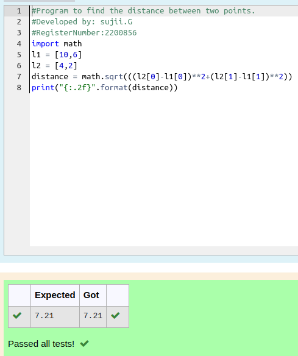

# DISTANCE-BETWEEN-TWO-POINTS

## AIM:
To write a python program to find the distance two 2 points
## ALGORITHM:
```
### Step 1: Imort math
### Step 2: Using math.sqrt(),solve()
### Step 3: Substitute the values in the distance formula  
### Step 4: Print distance using format
### Step 5: End the program
```
### PROGRAM:
```#Program to find the distance between two points.
#Developed by: sujii.G
#RegisterNumber:2200856
import math
l1 = [10,6]
l2 = [4,2]
distance = math.sqrt(((l2[0]-l1[0])**2+(l2[1]-l1[1])**2))
print("{:.2f}".format(distance))
```

  


### OUTPUT:



### RESULT:
Thus the distance between two points is successfully solved using python program
